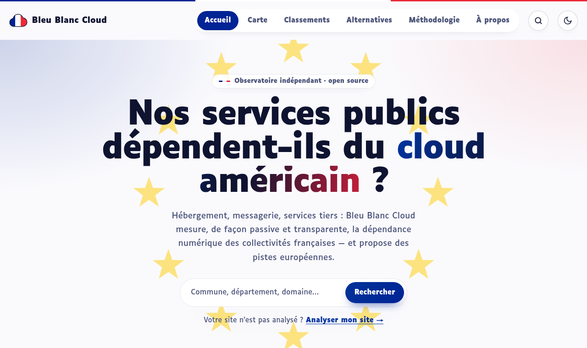
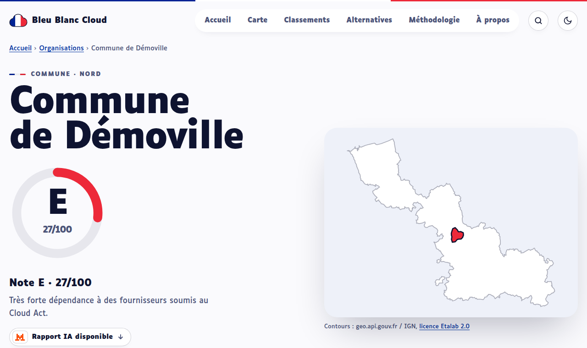
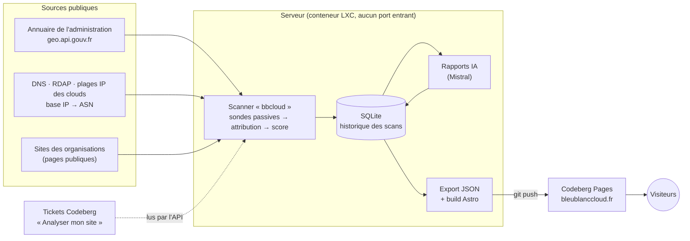

<p align="center">
  
</p>

<h1 align="center">Bleu Blanc Cloud</h1>

<p align="center">
  <strong>Observatoire indépendant et open source de la dépendance numérique des services publics français aux fournisseurs extra-européens.</strong>
</p>

<p align="center">
  <a href="https://bleublanccloud.fr">bleublanccloud.fr</a> ·
  <a href="docs/methodologie.md">Méthodologie</a> ·
  <a href="deploy/README.md">Déploiement</a> ·
  <a href="CONTRIBUTING.md">Contribuer</a> ·
  <a href="SECURITY.md">Sécurité</a>
</p>

<p align="center">
  <a href="https://github.com/Berachem/bleu-blanc-cloud/actions/workflows/qualite.yml"></a>
</p>



Où sont hébergés les sites des communes ? Qui achemine leur messagerie ? Quels services tiers leurs pages chargent-elles ? Lorsque ces fournisseurs relèvent du **Cloud Act** américain ou d'une loi extraterritoriale équivalente, les données des habitants et des agents peuvent être réclamées par une autorité étrangère, en dehors du droit européen.

Bleu Blanc Cloud rend cette dépendance **visible, mesurable et vérifiable**, organisation par organisation, et propose des pistes concrètes vers des solutions françaises et européennes. Le score est **indicatif** : il ne décrit que l'empreinte technique externe et visible publiquement, jamais les outils internes.

> Projet personnel, sans aucun lien avec l'État, une administration ou l'Union européenne.

## Fonctionnalités

- **Analyse strictement passive** à partir d'un nom de domaine : enregistrements DNS (A, AAAA, CNAME, NS, MX, TXT, SPF, DMARC, CAA), réseau et opérateur de chaque adresse IP, jusqu'à cinq pages publiques du site (en-têtes, cookies, ressources tierces), certificat TLS et bureau d'enregistrement. Robot identifié, une requête par seconde et par domaine, respect de `robots.txt`.
- **Attribution sourcée** : 158 fournisseurs, 116 règles de détection de services (mesure d'audience, polices, vidéos, cartes, captchas, suites bureautiques, envoi d'e-mails…) et 55 alternatives européennes, chaque fait étant accompagné d'au moins une source.
- **Score de 0 à 100 et note de A à E** selon une méthodologie publique et versionnée ; chaque point retiré est justifié par un constat et sa preuve.
- **Rapports rédigés par Mistral** pour les décideurs : synthèse, risques et plan de migration limité aux alternatives du référentiel. L'IA ne calcule jamais le score ; chaque texte généré est signalé comme tel.
- **Site 100 % statique** : carte de France par département, classements filtrables, fiche détaillée par organisation avec carte de situation zoomable, recherche instantanée, mode sombre, accessibilité (RGAA / WCAG 2.1 AA visés).
- **Analyses sur demande** : tout visiteur peut faire analyser son site via un ticket Codeberg, traité par le serveur sans aucun port entrant.
- **Cohérent avec son sujet** : aucun cookie, aucun traceur, aucune ressource externe par défaut (le fond de plan IGN des cartes de situation n'est chargé qu'à la demande du visiteur) ; hébergement sur Codeberg Pages (Allemagne), zone DNS chez OVHcloud (France) ; le site obtient la note A sur son propre scan.



## Architecture



| Dossier | Contenu |
|---|---|
| [`scanner/`](scanner/) | CLI Python `bbcloud` : import des cibles, sondes (DNS, IP/ASN, HTTP, TLS, RDAP), attribution, détection des services, score, rapports IA, stockage SQLite, export du contrat de données |
| [`site/`](site/) | Site Astro (sortie statique) : thème maison, carte SVG calculée au build, fiches, recherche |
| [`deploy/`](deploy/) | Services systemd, publication sur Codeberg Pages, installateur, [runbook](deploy/README.md) |
| [`docs/`](docs/) | [Méthodologie publique](docs/methodologie.md), [décisions d'architecture](docs/adr/) |

Les choix structurants sont documentés dans les ADR : [architecture](docs/adr/0001-architecture.md), [site statique](docs/adr/0002-site-statique.md), [illustration des fiches](docs/adr/0003-illustration-des-fiches.md), [domaine et redirections](docs/adr/0004-domaine-bleublanccloud-fr.md).

## Démarrage rapide

Prérequis : [uv](https://docs.astral.sh/uv/) et Node.js ≥ 22.12.

```bash
git clone https://github.com/Berachem/bleu-blanc-cloud.git
cd bleu-blanc-cloud
cp .env.example .env

# Scanner
cd scanner
uv sync
uv run pytest                       # tests sans réseau (réponses enregistrées, respx)
uv run bbcloud scanner berachem.dev # scan unitaire d'un domaine de test

# Site, avec les données de démonstration fictives
cd ../site
npm install
npm run dev                         # http://localhost:4321
```

Pendant le développement, seuls `berachem.dev`, `example.org` et `example.com` sont analysés. Les campagnes sur de vrais domaines ne se lancent que volontairement (`bbcloud campagne lancer`, avec confirmation).

### Commandes principales

| Commande | Rôle |
|---|---|
| `bbcloud referentiels maj` | plages IP des clouds, base IP → ASN, amorçage RDAP |
| `bbcloud referentiels verifier` | validation des référentiels et liste des faits à vérifier |
| `bbcloud scanner <domaine> [--json]` | scan unitaire et score |
| `bbcloud cibles importer --population-min 10000` | communes, départements et régions |
| `bbcloud campagne lancer [--limite N] [--dry-run]` | campagne de scan (confirmation demandée) |
| `bbcloud scores recalculer [--dry-run]` | recalcul des scores après une mise à jour du référentiel, sans nouveau scan |
| `bbcloud rapports generer [--max N] [--dry-run]` | rapports IA, avec estimation du coût |
| `bbcloud exporter --vers ../site/public/donnees` | fichiers JSON du site |
| `bbcloud publier` | export, build et publication sur Codeberg Pages |
| `bbcloud demandes traiter` | analyses sur demande (tickets Codeberg) |

La liste complète est donnée par `uv run bbcloud --help`. La mise en production (conteneur LXC Debian 12 sur Proxmox, Codeberg Pages, DNS, tâches planifiées) est décrite dans le [runbook de déploiement](deploy/README.md).

## Méthodologie

Chaque fournisseur est classé selon sa juridiction :

| Niveau | Définition | Points |
|---|---|---|
| **A** | Siège et maison mère dans l'Union européenne, non soumis à une loi extraterritoriale | 100 |
| **B** | Hors UE mais non soumis au Cloud Act (Suisse, Royaume-Uni…) | 70 |
| **C** | CDN extra-européen masquant l'hébergeur réel | 40 |
| **D** | Soumis au Cloud Act ou à une loi extraterritoriale équivalente | 0 |
| inconnu | Fournisseur non identifié : exclu du calcul et signalé | — |

Le score est la moyenne pondérée des catégories évaluables : hébergement du site (25), messagerie (25), DNS (10), suites collaboratives et SaaS (15), services tiers chargés par le site (15), mesure d'audience (10). Note : A ≥ 85, B ≥ 70, C ≥ 50, D ≥ 30, E < 30. Une note est affichée comme **provisoire** si plus de 30 % du poids applicable n'a pas pu être évalué.

La méthodologie complète, ses limites et l'historique des versions sont publiés dans [`docs/methodologie.md`](docs/methodologie.md) et sur [bleublanccloud.fr/methodologie](https://bleublanccloud.fr/methodologie/). Toute modification des règles de calcul donne lieu à une nouvelle version, enregistrée avec chaque score.

## Qualité

| Vérification | Commande |
|---|---|
| Lint et format (Python) | `uv run ruff check . && uv run ruff format --check .` |
| Typage (strict sur l'analyse et le score) | `uv run mypy` |
| Tests du scanner (≈ 750, sans réseau) | `uv run pytest --cov` |
| Types et tests du site | `npm run verifier && npm test` |
| Aucune requête externe, aucun cookie | `npm run build && npm run verifier:externe` |

Le workflow [`qualite.yml`](.github/workflows/qualite.yml) exécute l'ensemble à chaque push et à chaque demande de fusion.

## Éthique

- Analyse passive uniquement : aucun formulaire soumis, aucune authentification, aucun test de vulnérabilité.
- Liste de retraits vérifiée avant toute requête ; droit de réponse et de retrait traités sous 30 jours ([bleublanccloud.fr/retrait](https://bleublanccloud.fr/retrait/)).
- Aucune donnée personnelle collectée ni publiée ; l'IA ne reçoit que des constats techniques.
- Ton factuel : le score décrit une dépendance, pas une faute.

## Contribuer

Les contributions sont les bienvenues, en particulier sur les référentiels (fournisseurs, règles de détection, alternatives), qui doivent toujours être sourcés. Voir [CONTRIBUTING.md](CONTRIBUTING.md). Pour signaler une vulnérabilité, suivre la [politique de sécurité](SECURITY.md).

Le code est publié sur GitHub, avec un miroir sur [Codeberg](https://codeberg.org/berachem/bleu-blanc-cloud).

## Licence

- **Code** : [EUPL-1.2](LICENSE) — © Berachem Markria ([berachem.dev](https://berachem.dev)).
- **Données publiées** (scores, constats, fiches) : [Licence Ouverte 2.0 (Etalab)](https://www.etalab.gouv.fr/licence-ouverte-open-licence/), en citant « Bleu Blanc Cloud ».
- **Crédits** : police [Luciole](https://www.luciole-vision.com/) (CC-BY 4.0) ; contours administratifs IGN Admin Express COG via [france-geojson](https://github.com/gregoiredavid/france-geojson) et API Découpage administratif (Licence Ouverte) ; données des organisations issues de l'API Annuaire de l'administration (DILA).

## Développement

Ce projet a été développé avec l'assistance de [Claude Code](https://claude.com/claude-code), l'agent de programmation d'Anthropic, sous la direction de l'auteur.
